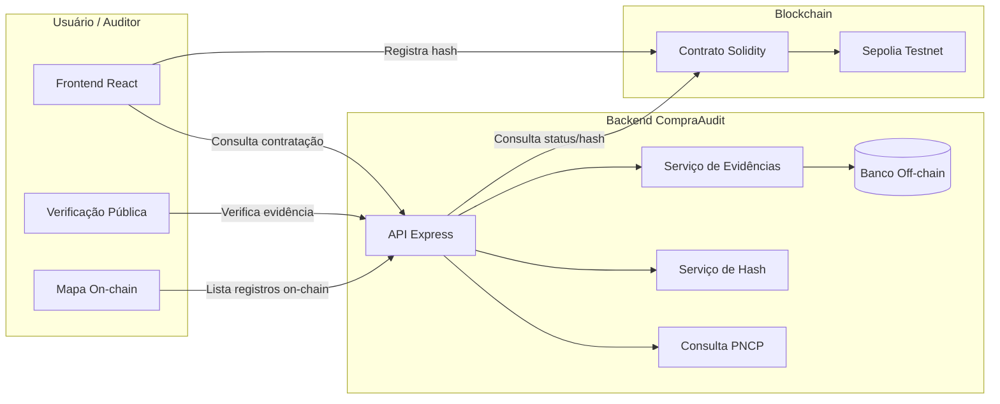
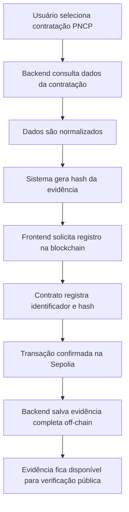
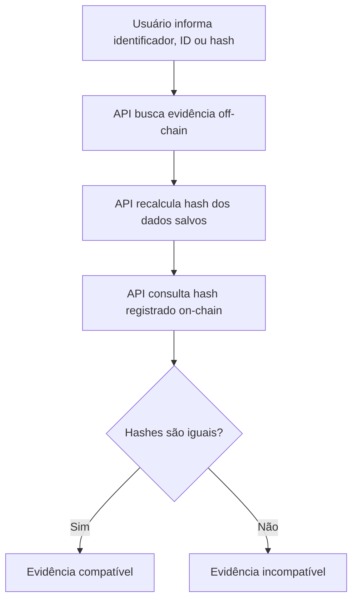
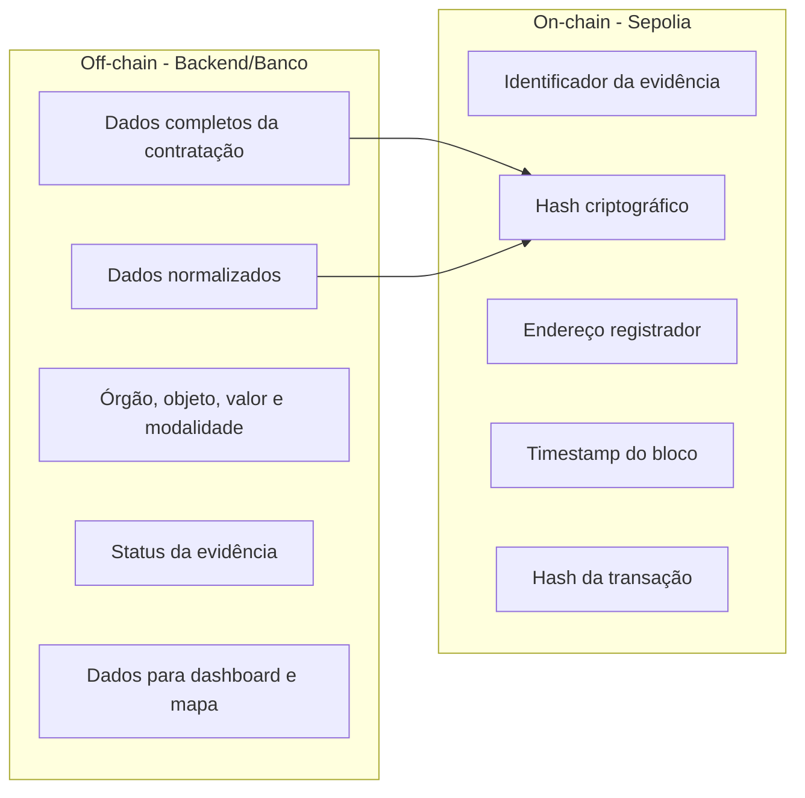

# CompraAudit - ProofChain

Auditoria pública de contratações do PNCP com prova de integridade registrada em blockchain.

## Sobre o desafio

Este projeto foi desenvolvido para o desafio **ProofChain** da Trilha Blockchain do HackWeb RESTIC 29.

O objetivo do desafio é construir uma solução prática que utilize blockchain como camada de confiança, rastreabilidade e verificação pública.

O CompraAudit aplica esse conceito ao contexto de **contratações públicas**, permitindo registrar evidências de auditoria em blockchain e verificar publicamente sua integridade.

---

## Objetivo do projeto

O **CompraAudit** tem como objetivo criar um MVP capaz de:

* consultar contratações públicas do PNCP
* normalizar os dados relevantes da contratação
* gerar um hash criptográfico da evidência
* registrar esse hash em uma testnet pública
* salvar os dados completos off-chain
* permitir verificação pública da integridade da evidência
* visualizar registros on-chain em um mapa interativo

---

## Problema

Contratações públicas envolvem dados sensíveis e relevantes para fiscalização social, como:

* órgão contratante
* objeto contratado
* modalidade
* valor
* data de publicação
* identificador da contratação

Hoje, a validação e a auditoria desses dados podem depender de bases centralizadas, prints, planilhas, documentos manuais ou registros que não oferecem uma prova pública de integridade.

Isso cria problemas como:

* dificuldade de verificar se uma evidência foi alterada;
* baixa rastreabilidade histórica;
* dependência de sistemas centralizados;
* dificuldade de auditoria independente;
* ausência de prova pública de existência e integridade.

---

## Solução

O CompraAudit registra em blockchain uma prova criptográfica da evidência analisada.

Em vez de gravar todos os dados da contratação na blockchain, o sistema registra apenas o **hash** dos dados normalizados. Os dados completos ficam armazenados off-chain, enquanto a blockchain funciona como camada pública de verificação.

Assim, se qualquer informação relevante da evidência for alterada, o hash calculado posteriormente será diferente do hash registrado on-chain.

---

## Por que blockchain?

Blockchain faz sentido neste projeto porque o problema envolve:

* confiança
* integridade
* rastreabilidade
* transparência
* verificação pública

A blockchain é usada como uma camada de prova, garantindo que uma evidência registrada não possa ser alterada silenciosamente depois.

O projeto não usa blockchain apenas como banco de dados. A blockchain registra a prova de integridade, enquanto o backend mantém os dados completos necessários para consulta e apresentação.

---

## Arquitetura geral



---

## Fluxo principal de registro



---

## Fluxo de verificação pública



---

## On-chain vs Off-chain



---

## Funcionalidades implementadas

* Consulta de contratações públicas do PNCP.
* Geração de hash dos dados normalizados.
* Registro de evidência em contrato Solidity na Sepolia.
* Consulta pública de evidência registrada.
* Verificação de compatibilidade entre hash calculado e hash on-chain.
* Prevenção de registro duplicado.
* Dashboard com métricas.
* Feed de sugestões de auditoria com base em critérios de risco.
* Mapa interativo com registros on-chain.
* Testes automatizados do contrato com Hardhat.
* Deploy do frontend e backend.

---

## Mapa de registros on-chain

O dashboard possui um mapa interativo com os registros já enviados para a blockchain.

Cada ponto azul representa uma evidência registrada on-chain.

Ao clicar em um ponto, o sistema exibe:

* município
* UF
* órgão
* identificador da contratação
* hash da evidência
* transação Sepolia
* link para detalhes da evidência

Registros sem município, UF ou localização confiável não são posicionados aleatoriamente no mapa. Eles são contabilizados separadamente como registros sem localização confiável.

---

## Contrato deployado

* Rede: **Sepolia Testnet**
* Contrato: `0x0c25D7F879C01173C1C0F728272804331dB5a503`
* Explorador: https://sepolia.etherscan.io/address/0x0c25D7F879C01173C1C0F728272804331dB5a503

---

## Tecnologias utilizadas

### Blockchain

* Solidity
* Hardhat
* Sepolia Testnet
* MetaMask
* Ethers.js

### Frontend

* React
* TypeScript
* Vite
* Tailwind CSS
* Leaflet
* React Leaflet

### Backend

* Node.js
* TypeScript
* Express
* Prisma
* Banco de dados relacional

### DevOps e deploy

* GitHub
* GitHub Actions
* Vercel
* Render

---

## Estrutura do projeto

```txt
CompraAudit/
├── contracts/
│   └── RegistroAuditoria.sol
├── scripts/
│   └── deploy.ts
├── test/
│   └── RegistroAuditoria.test.ts
├── frontend/
│   ├── src/
│   │   ├── components/
│   │   ├── pages/
│   │   ├── services/
│   │   └── api/
│   ├── server/
│   │   └── src/
│   └── public/
├── docs/
└── README.md
```

---

## Como executar localmente

### 1. Clonar o repositório

```bash
git clone COLE_AQUI_A_URL_DO_REPOSITORIO
cd CompraAudit
```

---

### 2. Instalar dependências da raiz

```bash
npm ci
```

---

### 3. Rodar os testes do contrato

```bash
npx hardhat test
```

Resultado esperado:

```txt
RegistroAuditoria
  ✔ deve registrar e consultar uma evidencia
  ✔ nao deve permitir registrar a mesma evidencia duas vezes

2 passing
```

---

### 4. Executar o frontend

```bash
cd frontend
npm ci
npm run dev
```

---

### 5. Executar o backend

```bash
cd frontend/server
npm ci
npm run dev
```

---

## Scripts principais

### Raiz

```bash
npm ci
npx hardhat compile
npx hardhat test
```

### Frontend

```bash
cd frontend
npm ci
npm run lint
npm run build
npm run dev
```

### Backend

```bash
cd frontend/server
npm ci
npm run lint
npm run dev
```

---

## Variáveis de ambiente

Crie os arquivos `.env` conforme a necessidade do ambiente local.

### Blockchain

```env
SEPOLIA_RPC_URL=COLE_AQUI_SUA_RPC
PRIVATE_KEY=COLE_AQUI_SUA_PRIVATE_KEY
CONTRACT_ADDRESS=0x0c25D7F879C01173C1C0F728272804331dB5a503
```

### Frontend

```env
VITE_CONTRACT_ADDRESS=0x0c25D7F879C01173C1C0F728272804331dB5a503
VITE_API_URL=COLE_AQUI_A_URL_DA_API
```

### Backend

```env
DATABASE_URL=COLE_AQUI_A_URL_DO_BANCO
PORT=3333
```

> Nunca envie chaves privadas reais para o GitHub.

---

## Evidências de funcionamento

Inclua os links finais antes da submissão.

### Frontend em produção

```txt
https://compra-audit.vercel.app/
```

### Contrato na Sepolia

```txt
https://sepolia.etherscan.io/address/0x0c25D7F879C01173C1C0F728272804331dB5a503
```

---

## Demonstração do fluxo

O fluxo principal demonstrado pelo MVP é:

1. consultar uma contratação pública;
2. revisar os dados normalizados;
3. gerar hash da evidência;
4. registrar o hash na Sepolia;
5. salvar a evidência off-chain;
6. verificar publicamente a integridade;
7. visualizar o registro no mapa on-chain.

---

## Diferenciais do projeto

* Uso correto de hash para prova de integridade.
* Separação entre dados on-chain e off-chain.
* Verificação pública de evidência.
* Registro em testnet pública.
* Dashboard com mapa interativo.
* Integração entre frontend, backend e contrato Solidity.
* Aplicação em um problema real de transparência pública.
* Fluxo funcional de consulta, registro e verificação.

---

## Limitações do MVP

O CompraAudit é um MVP acadêmico desenvolvido para o HackWeb.

Limitações atuais:

* utiliza a rede de testes Sepolia
* não é um sistema final de produção
* depende da disponibilidade das fontes consultadas
* registros sem localização confiável não aparecem como pontos no mapa
* ainda pode ser expandido com autenticação, perfis e trilhas de auditoria mais completas

---

## Melhorias futuras

* Persistir coordenadas dos municípios no backend.
* Indexar eventos on-chain.
* Melhorar filtros do mapa.
* Permitir relatórios exportáveis de auditoria.
* Adicionar perfil de auditor.
* Criar trilha de revisão da evidência.
* Suportar múltiplas redes blockchain.
* Melhorar critérios automáticos de risco nas sugestões de auditoria.

---

## Uso de inteligência artificial

Durante o desenvolvimento do projeto, ferramentas de inteligência artificial generativa foram utilizadas como apoio para:

* organização da documentação
* revisão de textos
* apoio na depuração de erros
* apoio na estruturação do README

Ferramentas utilizadas:

* Deep Seek e Gemini
---

## Equipe

* **Felipe Barbosa de Lima**

---

## Licença

Projeto desenvolvido para fins acadêmicos no HackWeb RESTIC 29 - Trilha Blockchain.