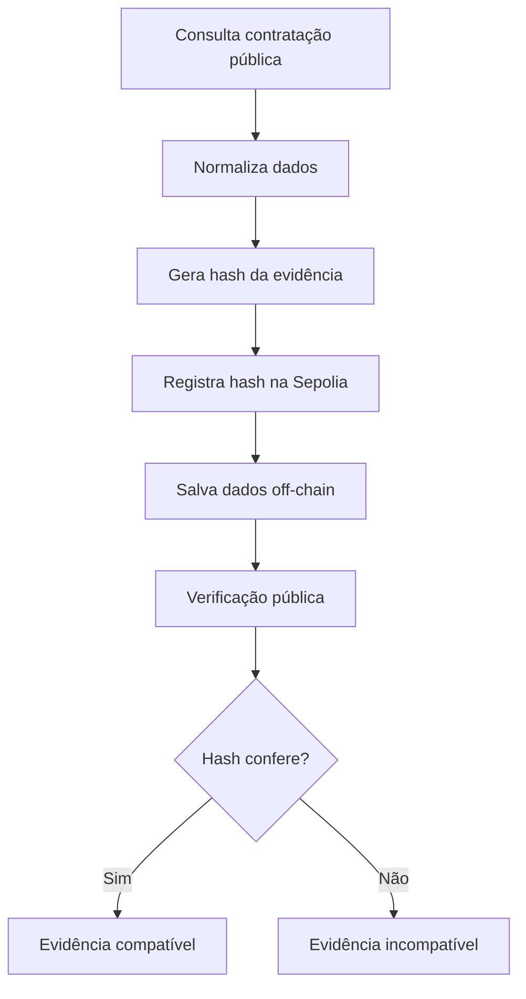

# 01 - Problema e Solução

## 1. Contexto

O **CompraAudit** é um MVP desenvolvido para o desafio **ProofChain** da Trilha Blockchain do HackWeb RESTIC 29.

A proposta do projeto é aplicar blockchain como camada de confiança para registros relacionados a **auditorias de contratações públicas**.

O sistema consulta dados do PNCP, gera uma evidência de auditoria, registra o hash dessa evidência em blockchain e permite que qualquer pessoa verifique publicamente se os dados continuam íntegros.

---

## 2. Problema

Contratações públicas envolvem informações relevantes para fiscalização, como:

* órgão contratante
* objeto contratado
* valor
* modalidade
* data de publicação
* identificador da contratação

Mesmo sendo dados públicos, a auditoria dessas informações ainda pode depender de registros frágeis, como planilhas, prints, documentos manuais ou bases centralizadas.

Isso gera uma dificuldade importante:

> Como comprovar, depois de uma análise que uma evidência de contratação pública não foi alterada?

Sem uma prova verificável, fica mais difícil garantir integridade, rastreabilidade e transparência sobre o que foi analisado.

---

## 3. Público afetado

A solução pode ser útil para:

* auditores
* analistas de dados públicos
* órgãos de controle
* cidadãos interessados em fiscalização
* instituições que precisam registrar evidências verificáveis

O objetivo é facilitar a validação pública de evidências relacionadas a contratações públicas.

---

## 4. Solução proposta

O **CompraAudit** cria uma prova criptográfica da evidência analisada.

O fluxo principal é:

1. o usuário consulta uma contratação pública
2. o backend normaliza os dados relevantes
3. o sistema gera um hash da evidência
4. o hash é registrado em um contrato inteligente na Sepolia
5. os dados completos ficam salvos off-chain
6. a verificação pública compara o hash calculado com o hash registrado na blockchain.

Assim, a blockchain não armazena todos os dados da contratação. Ela armazena a prova de integridade.

Se qualquer dado relevante for alterado, o hash muda e a verificação passa a indicar inconsistência.

---

## 5. Por que usar blockchain?

Blockchain faz sentido neste projeto porque o problema envolve:

* integridade
* rastreabilidade
* imutabilidade
* transparência
* verificação pública

A blockchain funciona como uma camada pública de confiança.
Ela permite registrar que uma evidência existia em determinado momento e que seu hash foi gravado em uma rede verificável.

O CompraAudit não usa blockchain como banco de dados principal.
Os dados completos ficam off-chain, enquanto a blockchain guarda apenas a prova criptográfica.

---

## 6. On-chain e off-chain

### On-chain

Na blockchain ficam:

* identificador da evidência
* hash criptográfico
* endereço registrador
* timestamp do bloco
* transação na Sepolia

### Off-chain

No backend ficam:

* dados completos da contratação
* dados normalizados
* órgão, objeto, valor e modalidade
* status da evidência
* informações para dashboard e mapa

Essa separação reduz custo e mantém a blockchain focada no que ela faz melhor: registrar uma prova pública e imutável.

---

## 7. Fluxo resumido

---

## 8. Aplicação prática

O CompraAudit pode apoiar cenários como:

* registro de evidências de auditoria
* análise de contratações públicas
* fiscalização social
* comprovação de integridade de dados públicos
* trilhas de verificação para relatórios

A solução também pode ser expandida para outros tipos de registros, como certificados, documentos técnicos, contratos, relatórios e cadeias de custódia.

---

## 9. Diferenciais

Os principais diferenciais do CompraAudit são:

* uso de hash para prova de integridade
* registro em testnet pública
* separação entre dados on-chain e off-chain
* verificação pública da evidência
* dashboard com mapa de registros on-chain
* aplicação em um problema real de transparência pública.

---

## 10. Conclusão

O CompraAudit demonstra como blockchain pode ser usada de forma prática para aumentar confiança e rastreabilidade em registros públicos.

O MVP registra hashes de evidências em blockchain, mantém os dados completos off-chain e permite verificar publicamente se uma evidência continua compatível com a prova registrada.