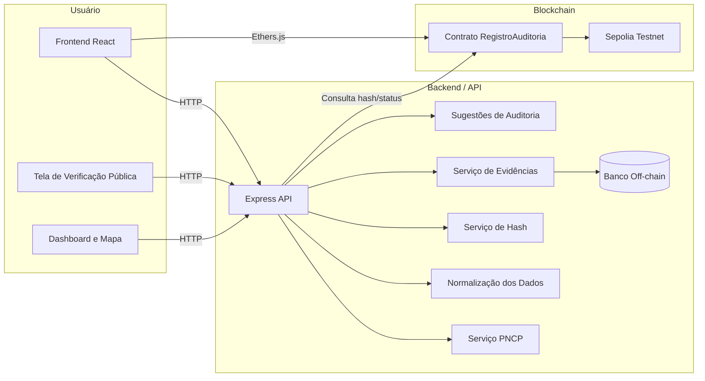
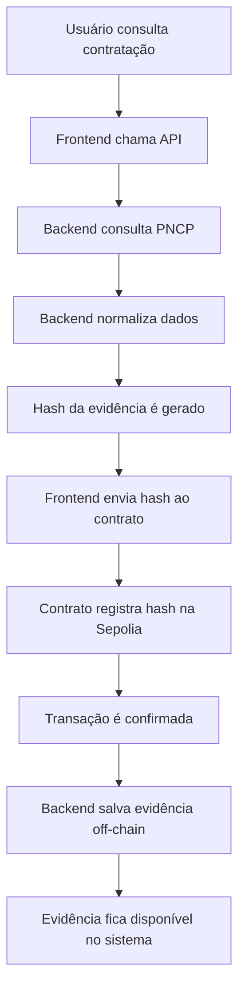
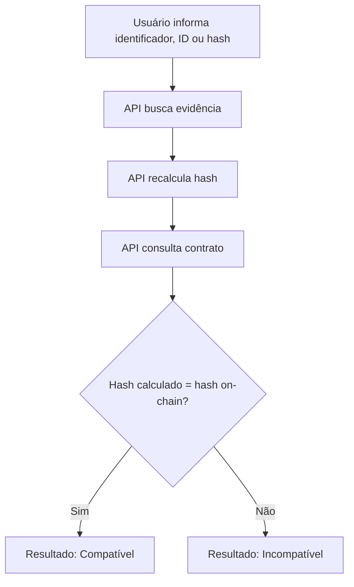
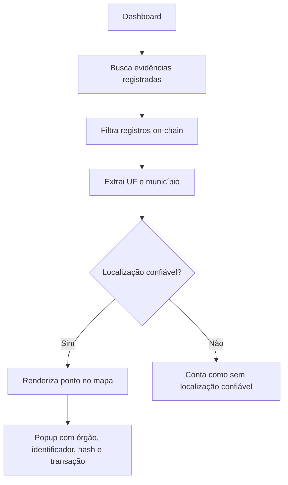

# 02 - Arquitetura

## 1. Visão geral

O **CompraAudit** é dividido em quatro camadas principais:

1. **Frontend** - interface web usada pelo usuário.
2. **Backend/API** - camada responsável por regras de negócio, consulta ao PNCP, normalização e armazenamento off-chain.
3. **Banco off-chain** - armazenamento dos dados completos das evidências.
4. **Blockchain** - camada pública de prova, onde o hash da evidência é registrado.

A arquitetura foi pensada para manter os dados completos fora da blockchain e registrar on-chain apenas a prova criptográfica da evidência.

---

## 2. Diagrama geral



---

## 3. Frontend

O frontend é a camada de interação com o usuário.

Ele permite:

* consultar contratações públicas;
* visualizar dados normalizados;
* registrar uma evidência em blockchain;
* verificar publicamente uma evidência;
* acompanhar métricas no dashboard;
* visualizar registros on-chain em mapa interativo.

Tecnologias utilizadas:

* React;
* TypeScript;
* Vite;
* Tailwind CSS;
* Ethers.js;
* Leaflet;
* React Leaflet.

---

## 4. Backend

O backend concentra as regras de negócio do MVP.

Ele é responsável por:

* consultar dados públicos do PNCP
* normalizar os dados da contratação
* gerar ou validar o hash da evidência
* salvar evidências no banco off-chain
* listar evidências registradas
* fornecer dados para dashboard
* fornecer rota pública de verificação
* buscar sugestões de auditoria com base em critérios de risco.

Tecnologias utilizadas:

* Node.js
* TypeScript
* Express
* Prisma
* banco de dados relacional

---

## 5. Blockchain

A blockchain é usada como camada de confiança.

O contrato inteligente registra a prova criptográfica da evidência, e não os dados completos da contratação.

A rede utilizada é:

```txt
Sepolia Testnet
```

Contrato:

```txt
0x0c25D7F879C01173C1C0F728272804331dB5a503
```

Explorador:

```txt
https://sepolia.etherscan.io/address/0x0c25D7F879C01173C1C0F728272804331dB5a503
```

---

## 6. Dados on-chain

Os dados on-chain representam a prova pública de integridade.

São registrados:

* identificador da evidência
* hash criptográfico dos dados normalizados
* endereço da carteira que realizou o registro
* timestamp do bloco
* transação na Sepolia

Esses dados permitem verificar se determinada evidência foi registrada e se o hash atual ainda corresponde ao hash original.

---

## 7. Dados off-chain

Os dados completos da evidência ficam no backend e no banco da aplicação.

São armazenados off-chain:

* dados da contratação
* dados normalizados usados na geração do hash
* órgão
* objeto
* valor
* modalidade
* data de publicação
* fonte
* status da evidência
* hash da transação
* informações para exibição no dashboard e no mapa

Essa decisão evita custo desnecessário na blockchain e mantém o contrato focado apenas na prova de integridade.

---

## 8. Fluxo de registro de evidência



---

## 9. Fluxo de verificação pública



A verificação pública permite validar se os dados salvos continuam compatíveis com a prova registrada na blockchain.

---

## 10. Fluxo do dashboard e mapa



O mapa exibe somente registros com localização confiável.
Registros sem UF, município ou coordenada válida não são posicionados aleatoriamente.

---

## 11. Estrutura de diretórios

```txt
CompraAudit/
├── contracts/
│   └── RegistroAuditoria.sol
├── scripts/
│   └── deploy.ts
├── test/
│   └── RegistroAuditoria.test.ts
├── frontend/
│   ├── src/
│   │   ├── components/
│   │   ├── pages/
│   │   ├── services/
│   │   └── api/
│   ├── server/
│   │   └── src/
│   └── public/
├── docs/
└── README.md
```

---

## 12. Principais responsabilidades

| Camada            | Responsabilidade                                          |
| ----------------- | --------------------------------------------------------- |
| Frontend          | Interface, registro via carteira, dashboard e verificação |
| Backend           | Consulta PNCP, normalização, hash, persistência e APIs    |
| Banco off-chain   | Armazenamento dos dados completos da evidência            |
| Contrato Solidity | Registro e consulta do hash da evidência                  |
| Sepolia           | Rede pública de teste para validação blockchain           |
| PNCP              | Fonte pública dos dados de contratações                   |

---

## 13. Decisão arquitetural principal

A principal decisão arquitetural do projeto foi separar:

* **dados completos off-chain**;
* **prova criptográfica on-chain**.

Essa abordagem deixa o MVP mais simples, barato e coerente com o uso real de blockchain.

A blockchain é usada para garantir integridade e rastreabilidade, enquanto o backend mantém os dados necessários para consulta, exibição e verificação.

---

## 14. Resumo

A arquitetura do CompraAudit segue o fluxo:

```txt
PNCP → Backend → Normalização → Hash → Blockchain → Banco Off-chain → Verificação Pública
```

Com isso, o projeto entrega uma solução funcional para registrar evidências de auditoria em blockchain e permitir validação pública posterior.

