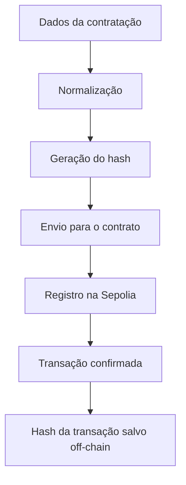
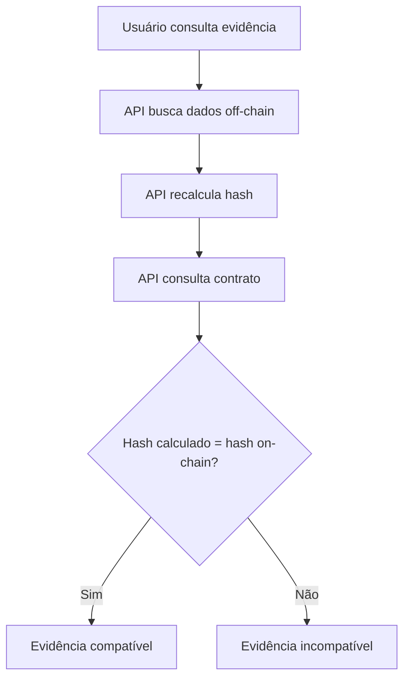

# 03 - Blockchain e Contrato

## 1. Visão geral

O CompraAudit usa blockchain como camada de prova para evidências de auditoria.

A blockchain não armazena todos os dados da contratação pública.
Ela armazena apenas o **hash criptográfico** dos dados normalizados da evidência.

Esse hash funciona como uma impressão digital do registro.
Se qualquer dado relevante for alterado depois, o hash calculado será diferente do hash registrado on-chain.

---

## 2. Rede utilizada

O contrato foi implantado na rede:

```txt
Sepolia Testnet
```

A Sepolia foi escolhida por ser uma testnet pública compatível com Ethereum, permitindo validar o fluxo de registro e consulta sem custo real de produção.

---

## 3. Contrato deployado

Endereço do contrato:

```txt
0x0c25D7F879C01173C1C0F728272804331dB5a503
```

Explorador Sepolia:

```txt
https://sepolia.etherscan.io/address/0x0c25D7F879C01173C1C0F728272804331dB5a503
```

---

## 4. Papel do contrato

O contrato inteligente é responsável por registrar e consultar provas de evidência.

Sua função principal no MVP é garantir que um determinado identificador de evidência esteja associado a um hash registrado em blockchain.

Com isso, o sistema consegue verificar posteriormente se os dados off-chain ainda correspondem ao hash gravado on-chain.

---

## 5. O que é registrado on-chain

Na blockchain ficam registrados dados mínimos para prova de integridade:

* identificador da evidência
* hash dos dados normalizados
* endereço da carteira que registrou
* timestamp do bloco
* hash da transação

O conteúdo completo da contratação não é salvo na blockchain.

Essa decisão reduz custo, evita exposição desnecessária de dados e mantém a blockchain focada na função de prova pública.

---

## 6. O que fica off-chain

No backend e no banco da aplicação ficam:

* dados completos da contratação
* dados normalizados usados no hash
* órgão
* objeto
* valor
* modalidade
* data de publicação
* fonte
* status do registro
* hash da transação
* dados auxiliares para dashboard e mapa

A verificação pública usa os dados off-chain para recalcular o hash e comparar com o hash registrado on-chain.

---

## 7. Fluxo de registro on-chain



---

## 8. Fluxo de verificação



---

## 9. Por que usar hash?

O hash permite representar os dados da evidência de forma compacta e verificável.

No CompraAudit, o hash é gerado a partir dos dados normalizados da contratação.

Vantagens do uso de hash:

* evita salvar dados completos na blockchain
* reduz custo de registro
* permite detectar alterações nos dados
* gera uma prova de integridade
* facilita a verificação pública.

Se os dados normalizados forem os mesmos, o hash será o mesmo.
Se qualquer campo relevante mudar, o hash também muda.

---

## 10. Proteção contra duplicidade

O contrato foi projetado para impedir que a mesma evidência seja registrada mais de uma vez com o mesmo identificador.

Essa regra evita duplicidade de registros e torna o fluxo mais claro para auditoria.

No MVP, quando uma evidência já está registrada, o sistema informa que ela já possui registro on-chain.

---

## 11. Testes do contrato

O contrato possui testes automatizados com Hardhat.

Comando para executar:

```bash
npx hardhat test
```

Resultado esperado:

```txt
RegistroAuditoria
  ✔ deve registrar e consultar uma evidencia
  ✔ nao deve permitir registrar a mesma evidencia duas vezes

2 passing
```

Esses testes validam o comportamento principal do contrato:

* registrar uma evidência;
* consultar uma evidência registrada;
* impedir registro duplicado.

---

## 12. Ferramentas blockchain utilizadas

* Solidity;
* Hardhat;
* Sepolia Testnet;
* MetaMask;
* Ethers.js.

---

## 13. Variáveis de ambiente relacionadas

Exemplo de variáveis usadas para deploy e integração:

```env
SEPOLIA_RPC_URL=SUA_RPC_SEPOLIA
PRIVATE_KEY=SUA_PRIVATE_KEY
CONTRACT_ADDRESS=0x0c25D7F879C01173C1C0F728272804331dB5a503
```

No frontend:

```env
VITE_CONTRACT_ADDRESS=0x0c25D7F879C01173C1C0F728272804331dB5a503
VITE_API_URL=URL_DA_API
```

> Chaves privadas nunca devem ser enviadas para o GitHub.

---

## 14. Resumo

A blockchain no CompraAudit é usada para registrar uma prova pública de integridade.

O fluxo é:

```txt
Dados normalizados → Hash → Contrato Solidity → Sepolia → Verificação pública
```

Essa abordagem permite que a evidência completa continue off-chain, enquanto a prova criptográfica fica registrada em uma rede pública e verificável.
