# 05 - Evidências de Funcionamento

## 1. Objetivo

Este documento reúne as principais evidências de funcionamento do **CompraAudit**, MVP desenvolvido para o desafio **ProofChain**.

---

## 2. Links principais

### Aplicação em produção

```txt
https://compra-audit.vercel.app/
```

### Contrato na Sepolia

```txt
https://sepolia.etherscan.io/address/0x0c25D7F879C01173C1C0F728272804331dB5a503
```

### Rede utilizada

```txt
Sepolia Testnet
```

### Endereço do contrato

```txt
0x0c25D7F879C01173C1C0F728272804331dB5a503
```

---

## 3. Evidência 1 - Aplicação em produção

A aplicação está publicada e acessível pela Vercel.

Link:

```txt
https://compra-audit.vercel.app/
```

Esta evidência comprova que o frontend do MVP está disponível para acesso público.

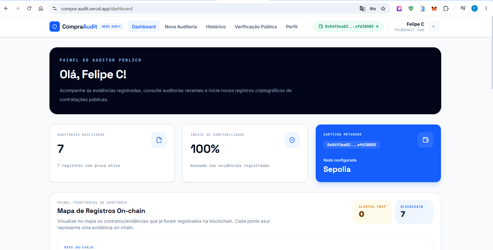


---

## 4. Evidência 2 — Contrato deployado na Sepolia

O contrato inteligente foi implantado na rede pública de testes **Sepolia**.

Link do contrato:

```txt
https://sepolia.etherscan.io/address/0x0c25D7F879C01173C1C0F728272804331dB5a503
```

Esta evidência comprova que existe um contrato público em testnet para registrar e consultar evidências.

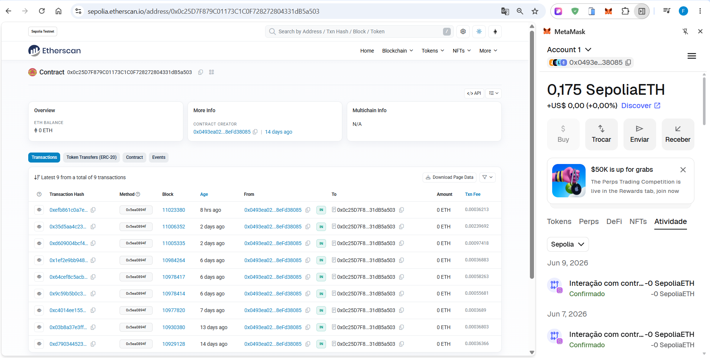

---

## 5. Evidência 3 — Consulta de contratação pública

O CompraAudit permite consultar uma contratação pública e visualizar os dados retornados.

Esta evidência comprova que o sistema consegue obter dados externos e iniciar o fluxo de auditoria. Clique em busca para obter os contratos.


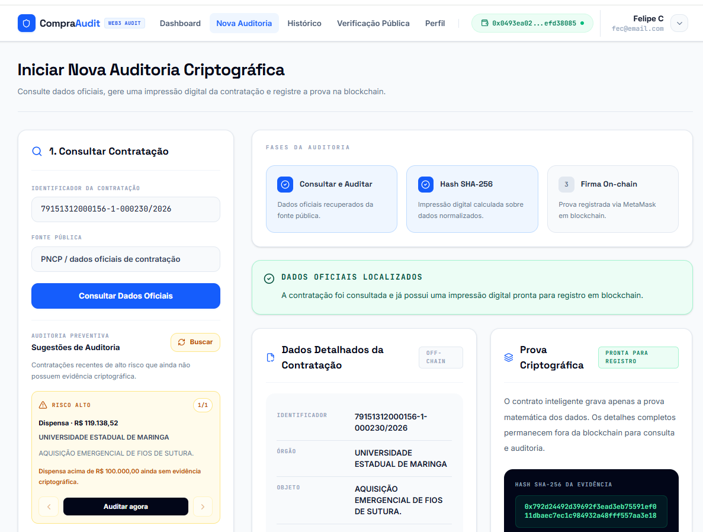

---

## 6. Evidência 4 — Dados normalizados da evidência

Após a consulta, o sistema organiza os dados relevantes em uma estrutura padronizada.

Esta evidência comprova que os dados usados para gerar o hash são exibidos de forma clara e auditável.

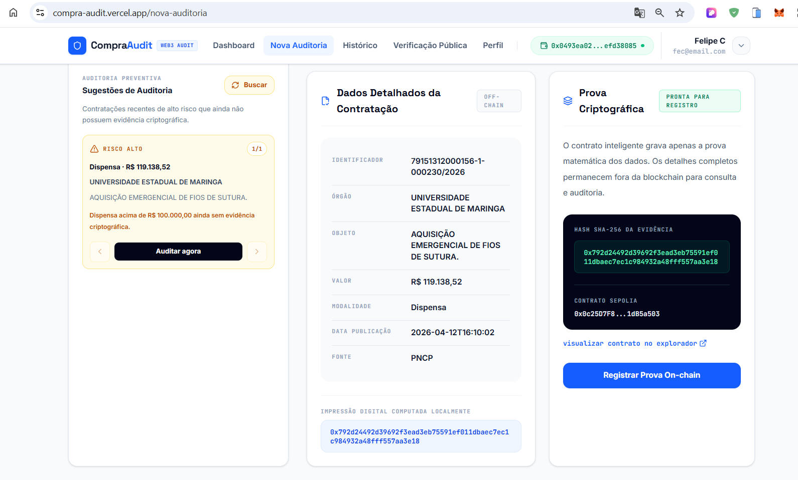

---

## 7. Evidência 5 — Registro on-chain

O sistema registra o hash da evidência no contrato inteligente implantado na Sepolia.

Esta evidência comprova o requisito de registro on-chain.

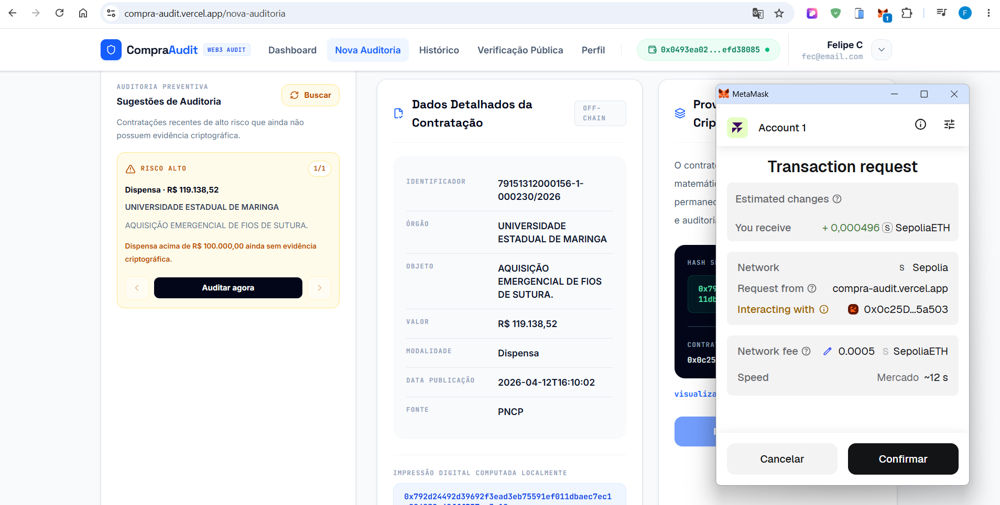

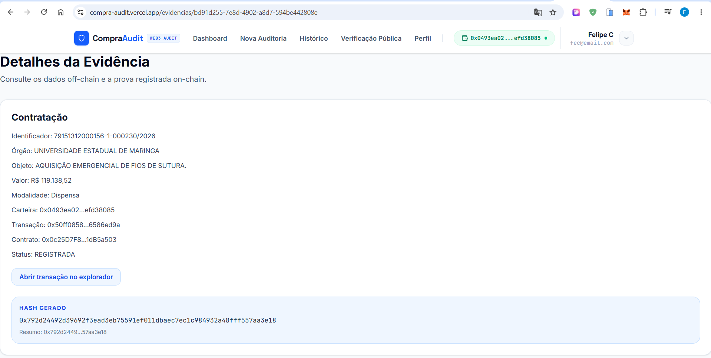

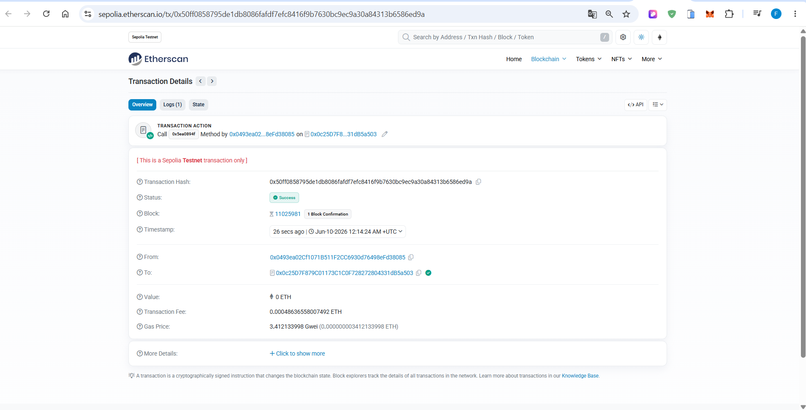

---

## 8. Evidência 6 — Verificação pública

A tela de verificação pública permite consultar uma evidência e comparar o hash calculado com o hash registrado on-chain.

Esta evidência comprova o requisito de consulta/verificação pública.

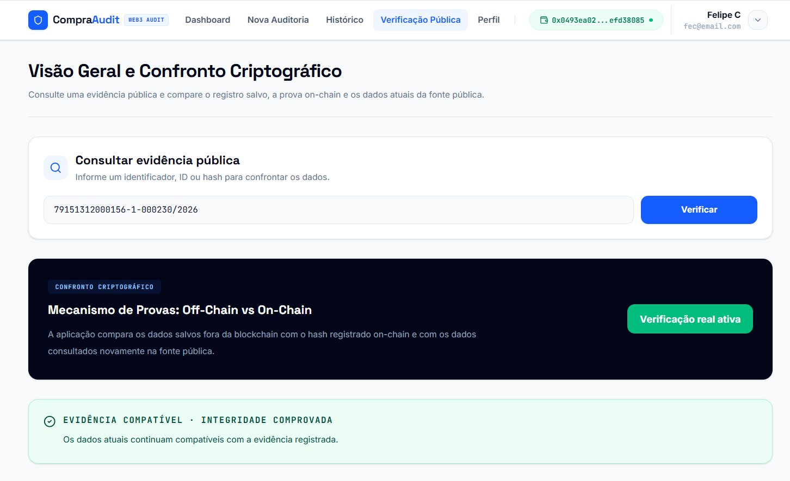

---

## 9. Evidência 7 — Dashboard

O dashboard apresenta uma visão geral das evidências e registros.

Esta evidência comprova que o projeto possui uma interface de acompanhamento do MVP.

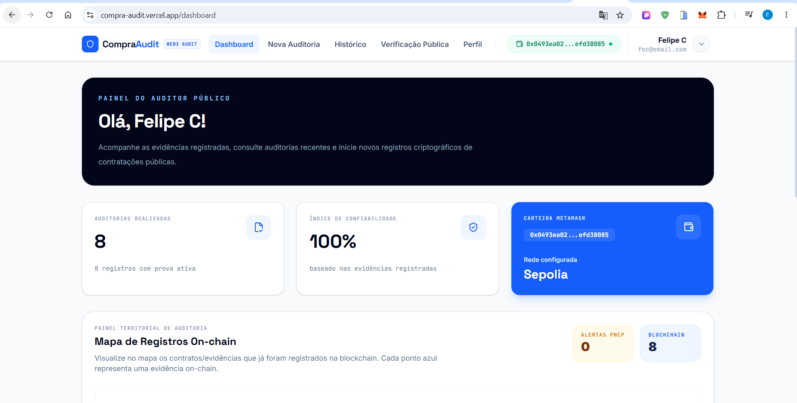

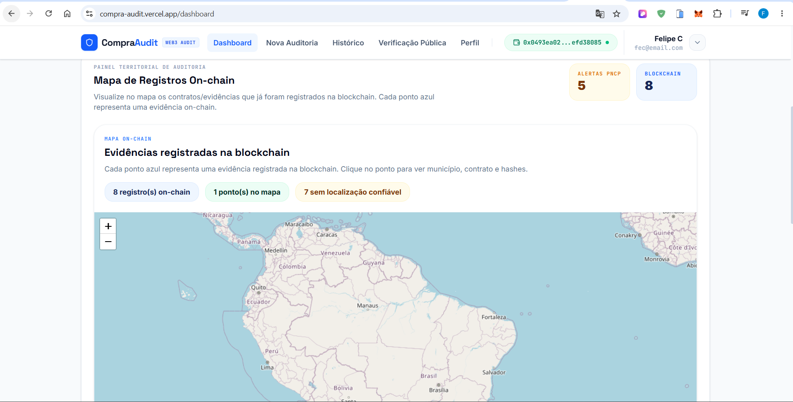

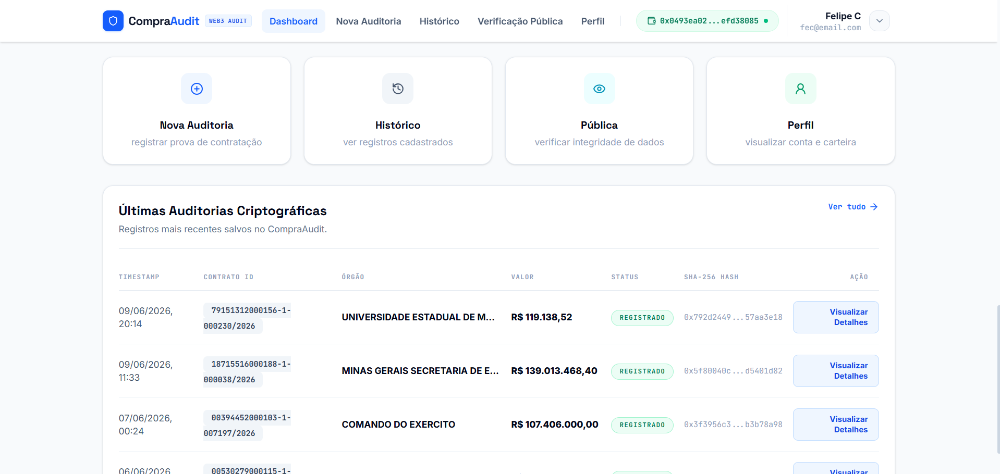

---

## 10. Evidência 8 — GitHub Actions e deploy

O projeto também foi validado no fluxo de CI/CD.

Esta evidência comprova que:

* o GitHub Actions executou corretamente;
* o deploy foi atualizado;
* a aplicação em produção reflete a versão final.

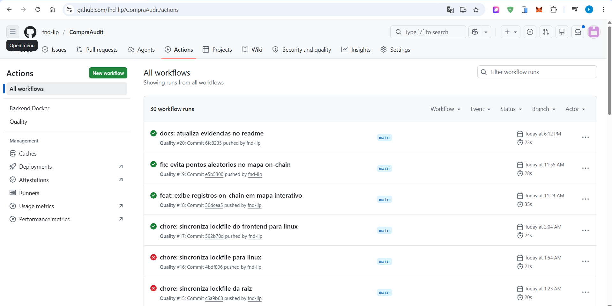

